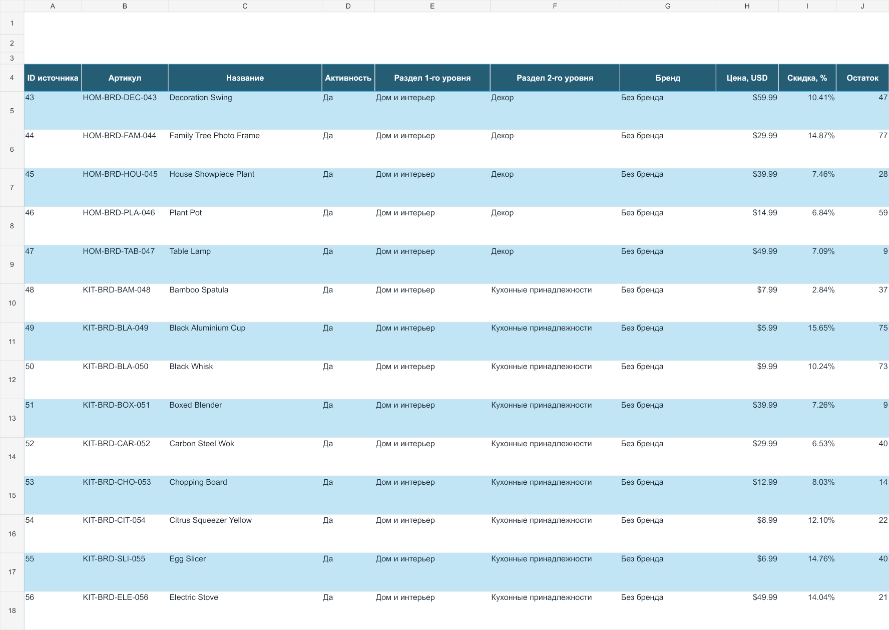
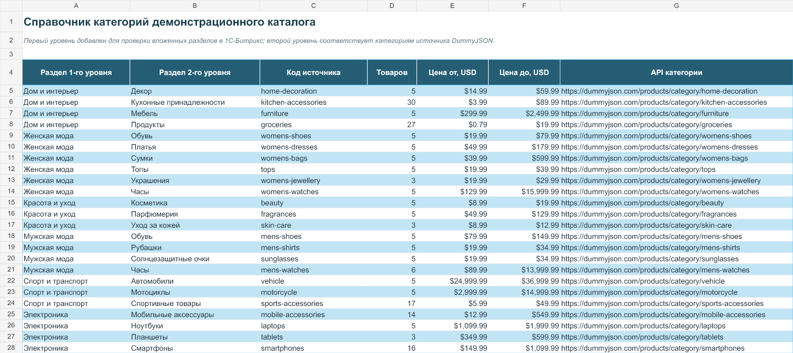
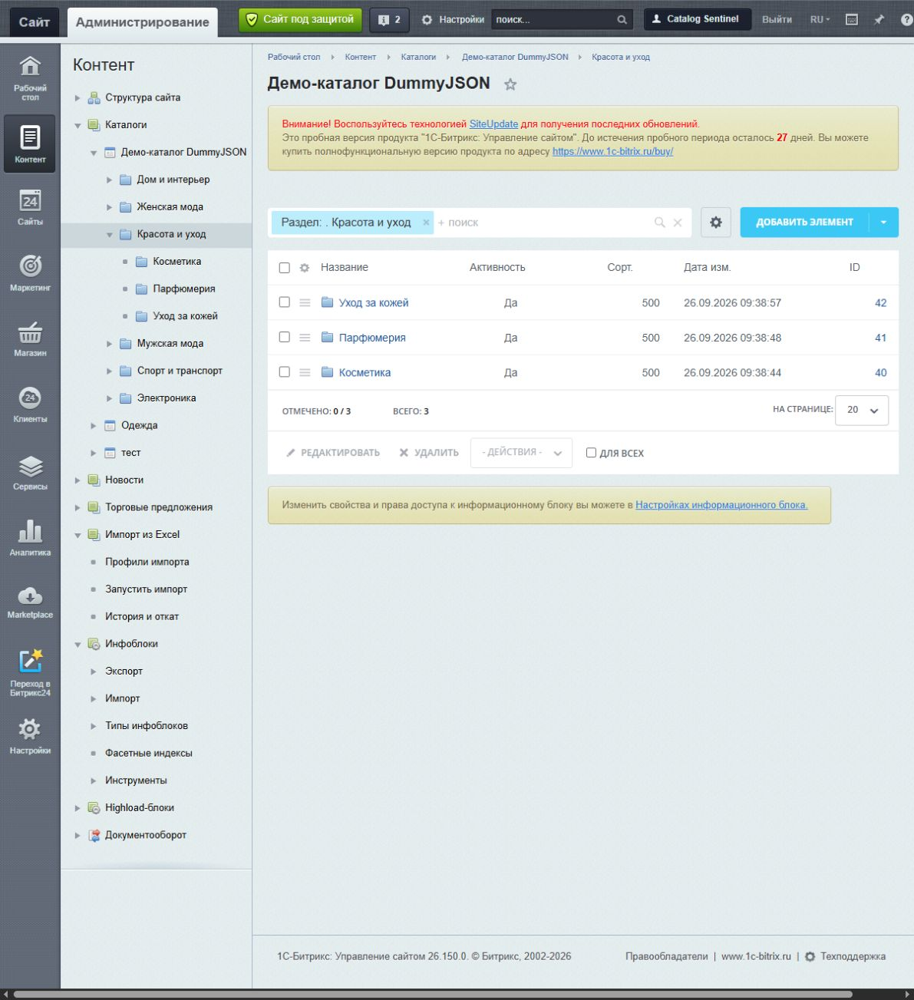
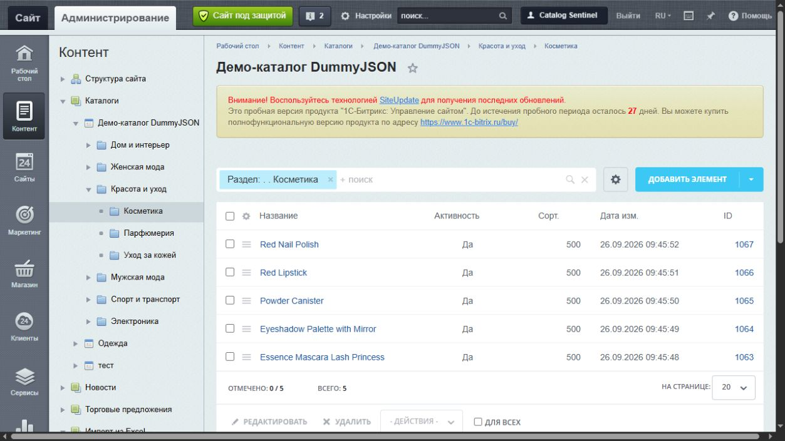
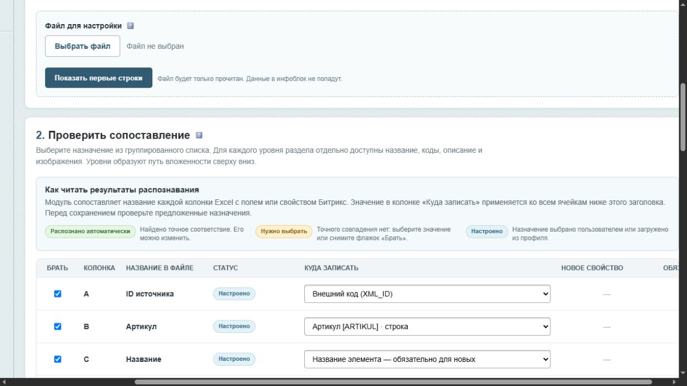
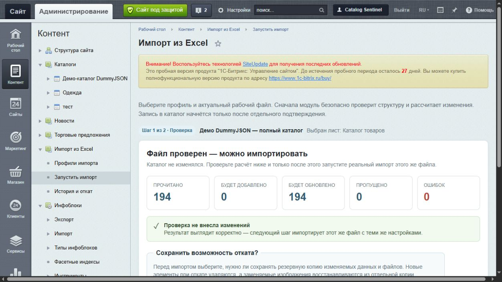

<div align="center">

# Импорт из Excel для 1С-Битрикс

### Превращает XLSX, XLS, ODS и CSV в готовый каталог — с разделами, свойствами, текстами и изображениями

[](install/version.php)
[](composer.json)
[](#требования)
[](tests/)
[](LICENSE)

**Понятная настройка для контент-менеджера. Контроль перед записью для администратора.**

[Скачать готовый модуль](https://github.com/YuryGorshkov/IMPORT_FROM_EXCEL/releases/latest) · [Посмотреть результаты CI](https://github.com/YuryGorshkov/IMPORT_FROM_EXCEL/actions)

[Как работает](#один-сценарий-от-файла-до-каталога) · [Проверенный каталог](#проверено-на-полном-каталоге) · [Презентация](output/presentation/IMPORT_FROM_EXCEL_Presentation_universal.pptx) · [Тестовая книга](demo/dummyjson_catalog_194.xlsx) · [Установка](#установка)

</div>

---

`webenot.importexcel` — независимый модуль импорта для инфоблоков 1С-Битрикс. Он помогает разобрать структуру таблицы, сопоставить колонки с полями Битрикс, проверить будущие изменения и только после подтверждения записать их в новый или существующий инфоблок.

## Зачем он нужен

Типичный каталог поставщика — это не «название и цена». В нём есть десятки колонок, несколько листов, разделы разных уровней, изображения по ссылкам, тексты, даты, числа и собственные названия характеристик. Ручной перенос занимает дни, а универсальный импорт без проверки легко создаёт дубли или записывает данные не туда.

Модуль переводит этот процесс в управляемый сценарий:

- показывает первые строки и помогает выбрать строку заголовков;
- даёт выбрать конкретный лист книги;
- распознаёт только однозначные назначения и не подставляет «первое свойство из списка»;
- позволяет выбрать существующее свойство или настроить новое в отдельном окне;
- строит вложенность разделов сверху вниз;
- скачивает изображения из публичных HTTP/HTTPS-ссылок;
- сначала выполняет проверку без записи;
- до импорта показывает счётчики изменений и размер возможного отката;
- сохраняет историю, умеет восстанавливать изменения и удалять ненужные архивы отката.

## Проверено на полном каталоге

Для сквозной проверки создан новый инфоблок и импортирован открытый каталог [DummyJSON Products](https://dummyjson.com/docs/products). Исходные данные и генератор тестовой книги находятся в [`demo`](demo/).

| Результат | Значение |
|---|---:|
| Товаров | **194** |
| Разделов | **30** |
| Уровней вложенности | **2** |
| Созданных свойств | **18** |
| Изображений анонса | **194** |
| Детальных изображений | **194** |
| Изображений галереи | **280** |
| Ошибок контрольной проверки | **0** |

Тестовая книга содержит 28 колонок и два листа. В неё входят артикулы, цены, остатки, размеры, тексты, теги, изображения и двухуровневая структура каталога.



Второй лист служит справочником структуры: шесть верхних разделов объединяют 24 товарные категории.



После импорта в Битрикс создаются обычные разделы и элементы. Они остаются доступны штатным компонентам, API и административным инструментам платформы.





## Один сценарий: от файла до каталога


### 1. Модуль читает структуру, а не угадывает смысл

Заголовок `Артикул`, `АРТИКУЛ` или любое внутреннее название поставщика остаётся названием колонки. Пользователь сам решает, куда записывать значения всех ячеек ниже по этому столбцу.

В таблице сопоставления есть отдельная колонка статуса:

- 🟢 **Распознано** — найдено однозначное системное поле или точное существующее свойство;
- 🟡 **Нужно выбрать** — требуется решение пользователя;
- 🔵 **Настроено** — назначение выбрано вручную.



### 2. Существующее свойство выбирается, новое — настраивается

Для существующего инфоблока модуль загружает реальные свойства по названию и символьному коду. Если нужного свойства нет, пункт **Создать новое свойство** открывает окно с параметрами `CIBlockProperty`: тип, активность, сортировка, название, символьный код, множественность, обязательность, поиск, фильтры, подсказки и дополнительные настройки типа.

Название берётся из заголовка таблицы, а символьный код заполняется транслитерацией. Пользователь может изменить его до сохранения профиля.

### 3. Системные поля остаются системными

Название элемента, символьный и внешний коды, активность, сортировка, даты, тексты и изображения записываются в штатные поля элемента. Для начала и окончания активности применяется проверка даты, для сортировки — числового значения, для активности — логического значения.

Символьные ключи Битрикс (`NAME`, `PREVIEW_PICTURE`, `DETAIL_TEXT` и другие) не показываются как названия пользовательских свойств и не создают дубли.

### 4. Разделы образуют реальную вложенность

Колонки `Раздел 1-го уровня`, `Раздел 2-го уровня` и следующие создают цепочку родительских разделов. Для каждого уровня доступны штатные поля раздела: ID, название, символьный и внешний коды, активность, сортировка, описание и изображения.

Внутреннее назначение `SECTION:2:NAME` используется только профилем. В адресах сайта участвуют обычные коды разделов Битрикс и шаблон `#SECTION_CODE_PATH#`.

### 5. Изображения можно передавать ссылками

Для изображений анонса, детальных изображений и свойств типа **Файл** поддерживаются:

- публичные HTTP/HTTPS-ссылки;
- внешние гиперссылки Excel;
- пути внутри `/upload`;
- ID существующих файлов Битрикс;
- несколько ссылок в одной ячейке для множественной галереи.

Удалённый файл скачивается повторно при временном сетевом сбое, ограничивается по размеру до 15 МБ, проверяется по фактическому MIME-типу и передаётся штатному файловому API Битрикс. Приватные IP и небезопасные схемы запрещены.

## Безопасность перед скоростью

### Обязательная проверка без записи

Первый запуск всегда рассчитывает результат и показывает:

- сколько строк прочитано;
- сколько элементов будет добавлено и обновлено;
- сколько строк пропущено;
- сколько найдено ошибок;
- какой объём займёт резервная копия;
- сколько файлов потребуется сохранить для восстановления.

Реальный импорт запускается отдельной кнопкой для того же файла и листа. Повторно выбирать их не нужно.



### Откат — осознанный выбор

Перед записью пользователь выбирает:

- **сохранить откат** — модуль сохранит изменяемые поля и отдельные копии заменяемых файлов;
- **импортировать без отката** — место не расходуется, но отменить этот запуск средствами модуля нельзя.

История показывает задания, счётчики, ошибки и размер архива. Ненужный откат можно удалить отдельно, не удаляя товары и журнал запуска.

### Защита входных данных

- принимаются только локальные обычные файлы XLSX, XLS, ODS и CSV;
- URL, PHP stream wrappers и символические ссылки вместо таблицы запрещены;
- размер файла по умолчанию ограничен 100 МБ;
- формулы не вычисляются — читаются сохранённые значения;
- XML обрабатывается актуальной веткой PhpSpreadsheet с защитой от XXE;
- административные операции требуют прав модуля и Bitrix session ID;
- произвольный PHP-код и `eval` не поддерживаются;
- загруженные файлы получают случайные имена и не сохраняются в Git.

## Что поддерживается

- XLSX, XLS, ODS и CSV;
- книги с несколькими листами;
- новый или существующий инфоблок;
- системные поля элемента;
- существующие и новые свойства разных типов;
- режимы `insert`, `update`, `upsert`;
- поиск существующего элемента по выбранному уникальному полю;
- вложенные разделы и их поля;
- тексты анонса и детальные тексты;
- одиночные и множественные изображения;
- HTTP/HTTPS-картинки и файлы Битрикс;
- пакетная обработка с продолжением после тайм-аута;
- проверка без записи, история и откат;
- веб-интерфейс и CLI для cron.

## Установка

### Один файл, без SSH и Composer

1. Скачайте [`install-import-excel.php`](https://github.com/YuryGorshkov/IMPORT_FROM_EXCEL/releases/latest/download/install-import-excel.php).
2. Загрузите его в корень сайта рядом с папкой `/bitrix`.
3. Войдите в Битрикс как администратор и откройте `https://ваш-сайт/install-import-excel.php`.
4. Нажмите **Установить модуль**.

Установщик скачает готовую сборку с зависимостями, проверит SHA-256, распакует её в `/local/modules/webenot.importexcel`, создаст таблицы и зарегистрирует модуль. После успешной установки файл удаляет себя по умолчанию.

### Git и Composer

```bash
cd /path/to/site/local/modules
git clone https://github.com/YuryGorshkov/IMPORT_FROM_EXCEL.git webenot.importexcel
cd webenot.importexcel
composer install --no-dev --classmap-authoritative
```

Затем установите **Импорт из Excel** в `Marketplace → Установленные решения`.

## Быстрый старт

1. Откройте `Контент → Импорт из Excel → Профили импорта`.
2. Создайте профиль и выберите существующий инфоблок либо нажмите **Создать инфоблок**.
3. Загрузите файл, выберите лист и строку с названиями колонок.
4. Проверьте сопоставление. Для новых характеристик выберите **Создать новое свойство**, для существующих — нужное свойство по имени и коду.
5. Укажите колонку уникальности, режим записи и источник символьного кода элемента.
6. Сохраните профиль и нажмите **Сохранить и проверить этот файл** либо откройте `Запустить импорт`.
7. Изучите расчёт без записи, выберите сохранение отката и подтвердите импорт.
8. Проверьте итог в инфоблоке и на странице `История и откат`.

## Демо-каталог для проверки

- презентация возможностей: [`IMPORT_FROM_EXCEL_Presentation_universal.pptx`](output/presentation/IMPORT_FROM_EXCEL_Presentation_universal.pptx);
- готовая книга: [`demo/dummyjson_catalog_194.xlsx`](demo/dummyjson_catalog_194.xlsx);
- генератор книги: [`demo/build/create_dummyjson_catalog.mjs`](demo/build/create_dummyjson_catalog.mjs);
- исходные данные: [`demo/source`](demo/source/);
- источник: [DummyJSON Products API](https://dummyjson.com/docs/products) и [репозиторий DummyJSON](https://github.com/Ovi/DummyJSON).

Книга предназначена для воспроизводимой проверки интерфейса, выбора листа, типов свойств, разделов и загрузки изображений. Данные каталога не входят в работу установленного модуля и не отправляются разработчику.

## CLI и cron

```bash
php local/modules/webenot.importexcel/bin/import.php \
  --document-root=/var/www/example/public_html \
  --profile=1 \
  --file=/var/import/catalog.xlsx \
  --sheet=Лист1
```

Добавьте `--dry-run` для проверки без записи. Команда возвращает ненулевой код при ошибках строк или фатальной ошибке задания.

## Как формируются коды новых свойств

Алгоритм переводит заголовок в верхний регистр, транслитерирует кириллицу, заменяет разделители на `_`, схлопывает повторные подчёркивания и устраняет совпадения суффиксами.

| Заголовок таблицы | Предложенный код |
|---|---|
| Мощность двигателя | `MOSHCHNOST_DVIGATELYA` |
| Номинальное напряжение, В | `NOMINALNOE_NAPRYAZHENIE_V` |
| 100% нагрузка | `FIELD_100_NAGRUZKA` |

Код показывается и редактируется только при создании нового свойства.

## Требования

- 1С-Битрикс с D7;
- PHP 8.1–8.4;
- Composer 2 для установки из исходников;
- PHP-расширения `dom`, `fileinfo`, `gd`, `mbstring`, `simplexml`, `xmlreader`, `xmlwriter`, `zip`.

PhpSpreadsheet зафиксирован на поддерживаемой ветке `^3.10.8`.

## Архитектура и хранение данных

Модуль создаёт собственные таблицы:

- `b_webenot_import_profile` — профили;
- `b_webenot_import_job` — задания и прогресс;
- `b_webenot_import_log` — диагностический журнал;
- `b_webenot_import_change` — изменения для отката.

Чтение файла, сопоставление, преобразования, запись, журнал и откат разделены на независимые сервисы. Интерфейсы `ReaderInterface`, `IblockGatewayInterface` и `ReporterInterface` позволяют добавлять другие источники и назначения без переписывания ядра.

## Текущие границы

Готовый пользовательский сценарий импортирует поля и свойства элементов инфоблоков, изображения и иерархию разделов. Торговые предложения, штатные цены и остатки модуля «Торговый каталог», удалённая загрузка самой таблицы и Highload-блоки пока не входят в него.

## Лицензия

MIT.
